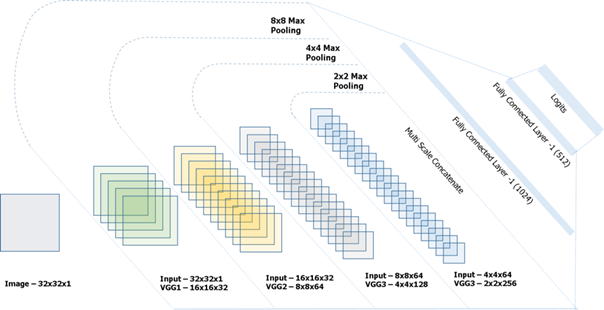
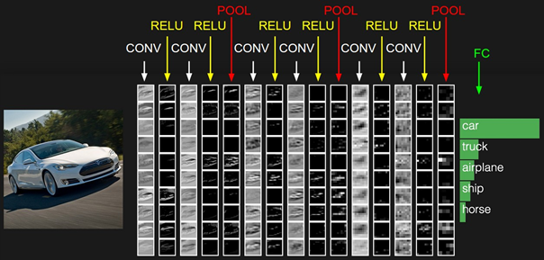

# Traffic-sign-recognition-with-a-convolutional-neural-network-built-from-scratch-python
Here we are trying to build a convolutional neural network from scratch without using any preprogrammed machine learning libraries. Our dataset is the German traffic sign dataset GTSRB.

Files follow the following structures (I couldn't upload the dataset they were too big)

-> Main File

      |GTSRB (Raw dataset)
      |Preprocessed_dataset_GTSRB
      |Preprocessed_testingSet_GTSRB
      |ConvNet.py
      |ConvNet_Structures.py
      |Preprocessed_dataset.py
      |Sign_recognition_with_ConvNet.py
     
## Main Goal
Here we want to implement a convolutional neural network to classify pictures of traffic signs. We'll base on the GTSRB dataset
which a German traffic sign dataset proposed during a competition. One can find it at http://benchmark.ini.rub.de/?section=gtsrb&subsection=news
The main point here is not to used preprogrammed machine learning libraries like TensorFlow or Keras. (This project is scholar project
for my engineering competitive exams.)

## Dataset and preprocessing 
We mainly have two datasets. A first one containing 39 252 RGB pictures in 44 different classes (the different main kind of sign one 
is likely to see while driving). The distribution of each class roughly follows the probability of seeing it in the road. 
The second dataset is the testing one containing 26 683 pictures and 44 classes. It is the one on which we check that our algorithm learnt something and isn't doing overfeating (The fact that an algorithm is over-learning its training set and is inefficient when a inputs of a giving class is a slit different from the one of the training set ).

Our preprocessing contains different phases. All the preprocessing operations are implemented in "Preprocessed_dataset.py" and the 
preprocessed datasets are respectively register in the files 'Preprocessed_dataset_GTSRB" and "Preprocessed_testing_GTSRB" so that
we don't have to reprocess them each time we want to run a test. During the Preprocessing we transform each image into greyscale ones 
(others have found better results by doing this) and we apply histogram Equalization (by spreading values on a bigger range we improve
the algorithm's discrimination). Then our training set is too little. We can expand it by applying some transformations. For example 
prohibited direction are 180° invariant. Then we rotate the picture and we created a new ones !!!! Some pictures, flipped represent 
a new sign. For example, a sign turn right, flipped become a sign turn left !!! In the end every picture is (32 * 32) sized.
Here's an example of a process picture : 

  

## Structures
I've tested two different structure for now. None of these work for now.... :'(. But I'm keep working on it (Y). 
The first one is called VGG and can roughly be represented this way :

  

The second is the one proposed by Yann LeCun and Pierre Sermanet in http://yann.lecun.com/exdb/publis/pdf/sermanet-ijcnn-11.pdf :

  

The module I've implemented to create these networks is "ConvNet.py". In this one every kind of layer (Convolution, Polling, Fully-Connected)
are defined as object. These layers are assembled in the object ConvNet (also from ConvNet.py) to form a Network object.
The two functions creating the two structures we presented above are in "ConvNet_Structures.py" and are of course using "ConvNet.py".
Please, note that by creating a ConvNet with the parameter "sign_recognition = True" we are creating a Yan LeCun Network. It was
easier for me to implement it directly in the ConvNet object. To create a VGGNet one has to use "createVGGNetNetwork()" from 
"ConvNet_Structures.py"

## Regularization 
I haven't used any kind of dropout (randomly inhibiting some neurons in order to limit the overfeating). I don't really know how necessary this is. My loss layer is a simple max (taking the index of the higher coordinate of my output vector. This index is equal to
the class my network thinks the given image belong to). I've arbitrarily set my learning rate at 0.01 for I've no idea what to put.
I intend to run different training so as to figure out which is the better learning rate. For now, I'll run my test with this Lr = 0.01.

## Training
I've run several trainings both for the LeCun's structure and the VGG (for now none of the two gives a satisfying answer). My networks processed 50 000 images in 18 hours. The testing part took 7 hours. Results are for now disappointing (my algorithm would have given better results by guessing randomly --'). I tried both by picking each picture randomly or a picture (randomly) in each class while running the training session. By picking each picture randomly we are adding the probabilies of presence in our network, but we risk that our algorithm only learn to answer a single value (associated with the most common sign). It's the opposite while browsing each class and picking randomly a picture in these.
